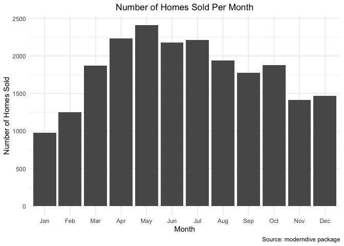
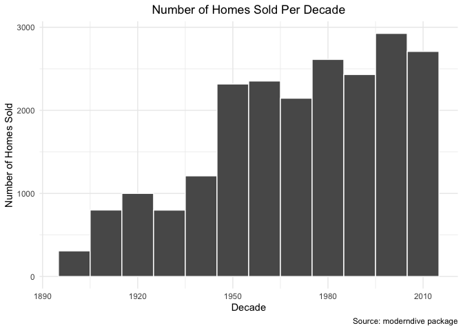
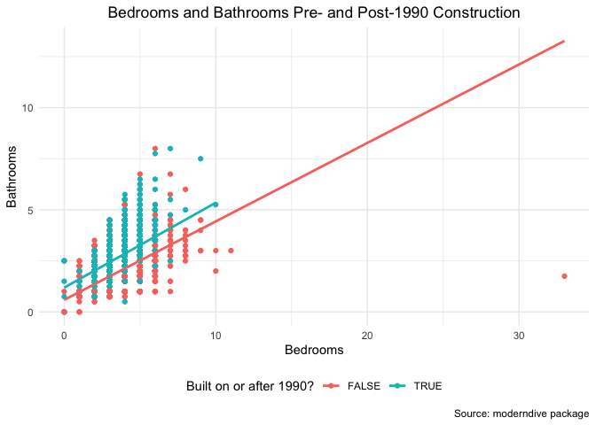

# Assignment \#2
Prof. Bell

For this homework, please produce a nicely-formatted graph that answers
each of the following questions. A nicely-formatted graph includes:

- Proper axis and legend labels
- A title, preferably centered
- A caption indicating the source of the data
- Any other aesthetic elements that make the graph visually pleasing

**Include a brief (1-2 sentence) written answer to the question as
well.**

You must submit your homework as a rendered Quarto document (HTML
preferred, PDF and Word acceptable). Please ensure that all code used to
generate the document (including your `setup` chunk) are visible in the
report. However, extraneous code that is not required for answering the
questions but that appears in your Quarto document will result in a
deduction (for example, `glimpse()` should not appear anywhere in your
rendered report).

Please turn in your `.qmd` file, the `_files` directory, and your
rendered Quarto document as a `.zip` folder on Blackboard. When you
export multiple items from Posit Cloud at once, it will automatically be
exported as a `.zip` (If you cannot get the report to render, you may
turn in only the `.qmd` file, but will lose points on the Quarto
elements of the grading rubric.)

In your `setup` chunk, install the `moderndive` package and load the
`house_prices` data.

``` r
# Not run
# install.packages("moderndive")
library(tidyverse)
library(moderndive)
data(house_prices)
```

1.  Create a new variable for the month that a home was sold using this
    command:

    `house_prices$month <- lubridate::month(house_prices$date, label = T)`

    What is the most popular month for home sales?

``` r
house_prices$month <- lubridate::month(house_prices$date, label = T)

ggplot(data = house_prices) +
    geom_bar(aes(x = month)) +
    labs(x = "Month",
             y = "Number of Homes Sold",
             title = "Number of Homes Sold Per Month",
             caption = "Source: moderndive package") +
    theme_minimal() +
    theme(plot.title = element_text(hjust = .5))
```



> The most popular month for home sales is May.

2.  In 1900, the population of King County was 110,053; in 2020, it was
    2.3 million. In what decade did home construction in King County
    start to grow dramatically? (Hint: You do not need to create a new
    variable; explore the `binwidth` argument.)

``` r
ggplot(data = house_prices) +
    geom_histogram(aes(x = yr_built), color = "white", binwidth = 10) +
    labs(x = "Decade",
             y = "Number of Homes Sold",
             title = "Number of Homes Sold Per Decade",
           caption = "Source: moderndive package") +
    theme_minimal() +
    theme(plot.title = element_text(hjust = .5))
```



3.  Design style has changed over the past century. Using a scatterplot,
    show how the number of bathrooms compares to the number of bedrooms.
    Do homes built on or after 1990 tend to have more bathrooms per
    bedroom than homes built before 1990?

    *1 bonus point: Add best fit lines to the scatterplot to show the
    strength of the relationship between bathrooms and bedrooms before
    and after 1990. Comment on these relationships.*

``` r
ggplot(data = house_prices, aes(x = bedrooms, y = bathrooms, color = yr_built >= 1990)) +
    geom_point() +
    geom_smooth(method = "lm", se = FALSE) +
    labs(x = "Bedrooms",
             y = "Bathrooms",
             color = "Built on or after 1990?",
             title = "Bedrooms and Bathrooms Pre- and Post-1990 Construction",
             caption = "Source: moderndive package") +
  theme_minimal() +
    theme(plot.title = element_text(hjust = .5),
          legend.position = "bottom")
```



> Homes built on or after 1990 tend to have more bathrooms per bedroom.
> The relationship between bedrooms and bathrooms is the same in both
> time periods, but the average number of bathrooms is higher at all
> numbers of bedrooms in the post-1990 period.

4.  What is the relationship between the condition of a home and it’s
    price? Please report prices in \$1000s, so divide price by 1000.
    (For condition, 1 = Poor, 2 = Fair, 3 = Average, 4 = Good, and 5 =
    Very Good.)

    *2 bonus points: Compare the relationship between condition and
    price for older and newer homes (however you choose to define that)
    using facets. Comment on whether age impacts the relationship
    between condition and price.*

``` r
house_prices$old <- ifelse(house_prices$yr_built < 1990, "Pre-1990", "Post-1990")

ggplot(data = house_prices) +
    geom_boxplot(aes(x = condition, y = price/1000)) +
    facet_wrap(~ old) +
    labs(x = "Condition",
             y = "Price ($1000s)",
             title = "Price of Homes Sold by Condition",
             caption = "Source: moderndive package") +
    theme_minimal() +
    theme(plot.title = element_text(hjust = .5))
```


> There is not a clear relationship between condition and price,
> especially for homes in the “average” condition and above. This is
> true for older and newer homes.
