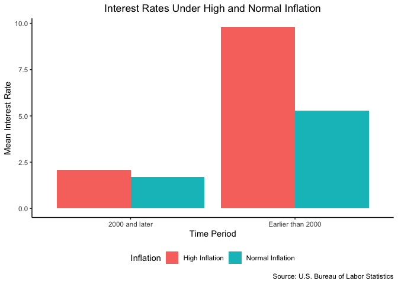

# Assignment \#3
Prof. Bell

For this homework, we will use the `dplyr` verbs and functions that we
learned in class to understand the relationship between interest rates
and inflation in the United States. **You must answer these questions
using the `dplyr` verbs and functions.**

You must submit your homework as a rendered Quarto document (HTML
preferred, PDF and Word acceptable). Please ensure that all code used to
generate the document (including your `setup` chunk) are visible in the
report. However, extraneous code that is not required for answering the
questions but that appears in your Quarto document will result in a
deduction (for example, `glimpse()` should not appear anywhere in your
rendered report).

Please turn in your `.qmd` file, the `_files` directory, and your
rendered Quarto document as a `.zip` folder on Blackboard. When you
export multiple items from Posit Cloud at once, it will automatically be
exported as a `.zip`.

``` r
library(tidyverse)
library(readxl)
```

1.  Load the inflation and interest rates data (available on the
    Blackboard assignment). The inflation data is the monthly percentage
    change in prices compared to the previous month (the inflation
    rate); the interest rates data is the interest rate in percentage
    points for each month.

``` r
inflation <- read_csv("../../data/data-wrangling/inflation.csv")
interest_rates <- read_xlsx("../../data/data-wrangling/interest_rates.xlsx",
                            .name_repair = "universal")
```

2.  Join the data frames together, keeping only the rows that match in
    both data frames.

``` r
df <- inner_join(inflation, interest_rates, by = join_by(month == Month, Year))
```

3.  Generate a table (`tibble`) containing the five months with the
    highest inflation rate since 2000.

``` r
df |>
  filter(Year >= 2000) |>
  arrange(-inflation_rate) |>
  slice_head(n = 5)
```

    # A tibble: 5 × 4
       Year month inflation_rate Interest.Rate
      <dbl> <dbl>          <dbl>         <dbl>
    1  2005     9            1.4          3.62
    2  2022     6            1.2          1.21
    3  2008     6            1            2   
    4  2022     3            1            0.2 
    5  2021    10            0.9          0.08

4.  What month had the largest increase in the interest rate compared to
    the previous month?

    *Hint: `lag(<column>)` provides the value of `<column>` in the
    previous row.*

``` r
df |>
  mutate(irate_change = Interest.Rate - lag(Interest.Rate)) |>
  arrange(-irate_change) |>
  slice_head(n = 1)
```

    # A tibble: 1 × 5
       Year month inflation_rate Interest.Rate irate_change
      <dbl> <dbl>          <dbl>         <dbl>        <dbl>
    1  1980     3            1.4          17.2         3.06

5.  Make one graph showing showing the yearly average inflation rate in
    orange and the yearly average interest rate in purple over time.

    *This graph will not have a legend. We will learn how to resolve
    this next week.*

``` r
df |>
  group_by(Year) |>
  summarize(mean_inflation = mean(inflation_rate),
            mean_ir = mean(Interest.Rate)) |>
  ggplot() +
    geom_line(aes(x = Year, y = mean_inflation), color = "orange") +
    geom_line(aes(x = Year, y = mean_ir), color = "purple") +
  labs(y = "Rate",
       x = "Year",
       title = "Interest Rates and Inflation",
       subtitle = "Interest rate in purple, inflation in orange",
       caption = "Source: U.S. Bureau of Labor Statistics") +
  theme_classic() +
  theme(plot.title = element_text(hjust = .5),
        plot.subtitle = element_text(hjust = .5))
```


6.  Make a graph comparing the average monthly interest rate when
    inflation is high (0.6% or greater) vs. normal (less than 0.6%),
    additionally comparing between the year 2000 and later vs. earlier.

    *Hint: You can use `ifelse()` in the tidyverse when making or
    modifying a column*

``` r
df |>
  mutate(inflation_high = ifelse(inflation_rate >= 0.6, "High Inflation", "Normal Inflation"),
         time = ifelse(Year >= 2000, "2000 and later", "Earlier than 2000")) |>
  group_by(inflation_high, time) |>
  summarize(mean_ir = mean(Interest.Rate)) |>
  filter(!is.na(inflation_high)) |>
  ggplot() +
    geom_bar(aes(x = time, y = mean_ir, fill = inflation_high),
              stat = "identity", position = "dodge") +
  labs(y = "Mean Interest Rate",
       x = "Time Period",
       fill = "Inflation",
       title = "Interest Rates Under High and Normal Inflation",
       caption = "Source: U.S. Bureau of Labor Statistics") +
  theme_classic() +
  theme(plot.title = element_text(hjust = .5),
        legend.position = "bottom")
```


