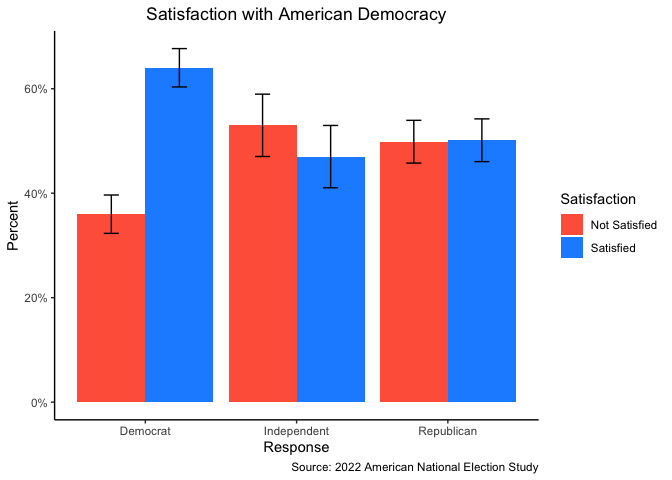

# Final Exam
Prof. Bell

The American National Election Study (ANES) is a federally-funded survey
of the American electorate taken at each presidential and mid-term
election cycle. The survey is used by academic researchers to track
American public opinion over time and is known for its high-quality
data. For this assignment, we will be using data from the 2022 ANES.
This particular survey is considered a pilot study, and was conducted by
YouGov using a non-probability sample.

You must submit your exam as a rendered Quarto document (HTML preferred,
PDF and Word acceptable). Please ensure that all code used to generate
the document (including your `setup` chunk) are visible in the report.
However, extraneous code that is not required for answering the
questions but that appears in your Quarto document will result in a
deduction (for example, `glimpse()` should not appear anywhere in your
rendered report).

Please turn in your `.qmd` file, the `_files` directory, and your
rendered Quarto document as a `.zip` folder on Blackboard. When you
export multiple items from Posit Cloud at once, it will automatically be
exported as a `.zip` file.

``` r
library(tidyverse)
library(sjstats)
library(sjPlot)
```

1.  Load the data and remove any rows that are missing a value in the
    `weight` column.

``` r
poll <- read_csv("../../data/final-exam/anes_pilot_2022_csv_20221214.csv") |>
  filter(!is.na(weight))
```

2.  We will be working with the question, “On the whole, how satisfied
    are you with the way democracy works in the United States?” The
    relevant variable is `demsatisfy` and the values in this field
    represent:

    - 1 - Extremely satisfied
    - 2 - Very satisfied
    - 3 - Moderately satisfied
    - 4 - Slightly satisfied
    - 5 - Not at all satisfied

    Modify this variable so that we can compare those who are
    moderately, very, or extremely satisfied to all other responses.

    In addition, political party is represented by the variable `pid_x`,
    and the values in this field represent:

    - 1 - Strong Democrat
    - 2 - Democrat
    - 3 - Lean Democrat
    - 4 - Independent
    - 5 - Lean Republican
    - 6 - Republican
    - 7 - Strong Republican

    Modify this variable so that we can compare Democrats, Republicans,
    and Independents.

``` r
poll <-
  poll |>
  mutate(satisfied = ifelse(demsatisfy %in% c(1:3), "Satisfied", "Not Satisfied"),
         party = ifelse(pid_x %in% c(1:3), "Democrat", ifelse(pid_x == 4, "Independent", "Republican")))
```

3.  Generate a nicely-formatted graph that shows the weighted topline
    results of the democratic satisfaction question, comparing
    Democrats, Republicans, and Independents.

``` r
poll |>
  filter(!is.na(party)) |>
  count(party, satisfied, wt = weight) |>
  group_by(party) |>
  mutate(prop = n/sum(n),
         resp = sum(n),
         moe = 1.96 * sqrt((prop * (1 - prop))/resp)) |>
  ggplot() +
  geom_bar(aes(x = party, y = prop, fill = satisfied), stat = "identity", position = "dodge") +
    geom_errorbar(aes(x = party, ymin = prop-moe, ymax = prop+moe, group = satisfied), position = position_dodge(.9), width = .2) +
  scale_y_continuous(labels = scales::percent_format()) +
  scale_fill_manual(values = c("tomato", "dodgerblue")) +
  labs(x = "Response",
       y = "Percent",
       fill = "Satisfaction",
       title = "Satisfaction with American Democracy",
       caption = "Source: 2022 American National Election Study") +
  theme_classic() +
  theme(plot.title = element_text(hjust = .5))
```



4.  Conduct a weighted hypothesis test showing whether a majority of
    Americans are satisfied with American democracy. You must write both
    the $H_0$ and the $H_A$. How do you interpret the results of your
    hypothesis test?

``` r
poll |>
  mutate(satisfied = ifelse(demsatisfy %in% c(1:3), 1, 0)) |>
  weighted_ttest(satisfied,
                 mu = .5,
                 weights = weight,
                 alternative = "greater")
```


    One Sample t-test (greater)
    # t=4.42  df=1499  p-value=0.000

      mean of satisfied: 0.557 [0.536, Inf]

5.  Conduct a linear probability regression model of satisfaction with
    American democracy (the dependent variable) on political party. Use
    Independents as your reference level for political party.

    How do you interpret the effect of political party on satisfaction
    with American democracy?

``` r
poll2 <-
  poll |>
  mutate(satisfied = ifelse(demsatisfy %in% c(1:3), 1, 0),
         party = relevel(factor(party), ref = "Independent"))

reg1 <- lm(satisfied ~ party, data = poll2)

tab_model(reg1,
          pred.labels = c("Intercept", "Democrat", "Republican"),
          dv.labels = "Satisfied with Democracy")
```

|                                        |                          |              |             |
|:--------------------------------------:|:------------------------:|:------------:|:-----------:|
|                                        | Satisfied with Democracy |              |             |
|               Predictors               |        Estimates         |      CI      |      p      |
|               Intercept                |           0.50           | 0.44 – 0.56  | **\<0.001** |
|                Democrat                |           0.15           | 0.08 – 0.22  | **\<0.001** |
|               Republican               |           0.01           | -0.06 – 0.08 |    0.849    |
|              Observations              |           1498           |              |             |
| R<sup>2</sup> / R<sup>2</sup> adjusted |      0.020 / 0.019       |              |             |

6.  A “feeling thermometer” question asks respondents to rate their
    feelings towards a person, place, or thing on a scale of 0 to 100,
    where 0 is very “cold” or negative and 100 is very “warm” or
    positive.

    Conduct a linear regression of how warmly respondents feel towards
    President Biden (variable `ftbiden`, the dependent variable) on
    satisfaction with democracy and at least two confounders. Please
    explain why you chose to control for those two confounders (i.e.,
    why do you think that variable is a confounder?)

    How do you interpret the effect of satisfaction with American
    democracy on feelings toward President Biden?

    Some potential confounders include:

    - Birth year: `birthyr_dropdown` (be sure to convert this to age)
    - Gender: `gender` (1 - Male, 2 - Female)
    - Education: `educ` (1 - No high school, 2 - High school, 3 - Some
      college, 4 - Associate’s degree, 5 - Bachelor’s, 6 - Post-grad)
    - Family income: `faminc_new` (treat this as a continuous variable)
    - Urban-rural status: `urbanicity2` (1 - Big city, 2 - Smaller city,
      3 - Suburban area, 4 - Small town, 5 - Rural area)

    *Hint: Make sure that categorical variables are treated as such in
    the regression, and not as continuous variables.*

``` r
poll3 <-
  poll2 |>
  mutate(educ = factor(educ))

reg2 <- lm(ftbiden ~ satisfied + educ + faminc_new, data = poll3)

tab_model(reg2,
          pred.labels = c("Intercept", "Satisfied with Democracy", "High School", "Some College", "Associate's", "Bachelor's", "Post-grad", "Income"),
          dv.labels = "Feeling Thermometer: Biden")
```

|                                        |                            |               |             |
|:--------------------------------------:|:--------------------------:|:-------------:|:-----------:|
|                                        | Feeling Thermometer: Biden |               |             |
|               Predictors               |         Estimates          |      CI       |      p      |
|               Intercept                |           32.78            | 24.76 – 40.80 | **\<0.001** |
|        Satisfied with Democracy        |           20.53            | 17.03 – 24.02 | **\<0.001** |
|              High School               |           -2.84            | -11.24 – 5.55 |    0.507    |
|              Some College              |           -1.66            | -10.26 – 6.95 |    0.706    |
|              Associate's               |           -1.26            | -10.94 – 8.43 |    0.799    |
|               Bachelor's               |            4.14            | -4.40 – 12.68 |    0.342    |
|               Post-grad                |            3.18            | -6.05 – 12.42 |    0.499    |
|                 Income                 |           -0.03            | -0.09 – 0.03  |    0.306    |
|              Observations              |            1500            |               |             |
| R<sup>2</sup> / R<sup>2</sup> adjusted |       0.089 / 0.085        |               |             |
