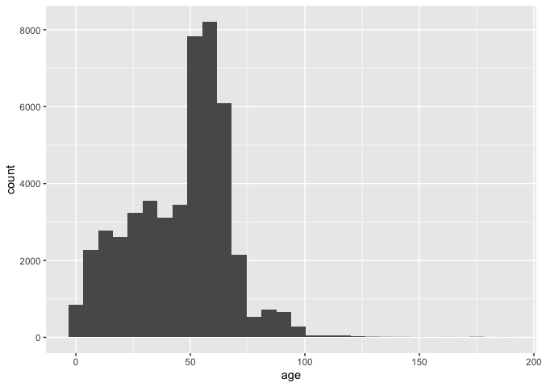
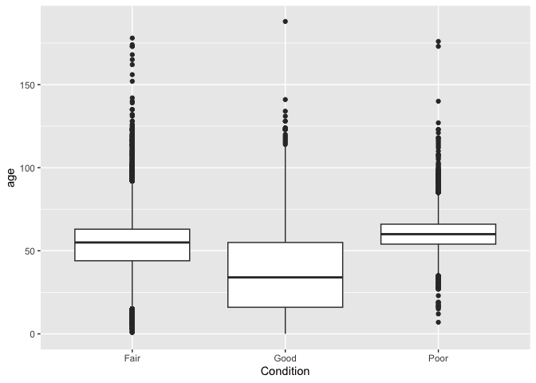

# Midterm Exam
Prof. Bell

The Bipartisan Infrastructure Law of 2021 is a signature achievement of
the Biden Administration. This act includes \$550 billion in new
spending on infrastructure improvements, such as repairing bridges that
are becoming unsafe for travel.

There are more than 600,000 bridges in the United States. Using data
from the Federal Highway Authority, we will answer the questions:
**Which bridges should the Biden Administration prioritize with new
infrastructure spending?**

Please use the “Mid-term Exam” project on Posit Cloud for this work.

You must submit your exam as a rendered Quarto document (HTML preferred,
PDF and Word acceptable). Please ensure that all code used to generate
the document (including your `setup` chunk) are visible in the report.
However, extraneous code that is not required for answering the
questions but that appears in your Quarto document will result in a
deduction (for example, `glimpse()` should not appear anywhere in your
rendered report).

Please turn in your `.qmd` file, the `_files` directory, and your
rendered Quarto document as a `.zip` folder on Blackboard. When you
export multiple items from Posit Cloud at once, it will automatically be
exported as a `.zip` file.

``` r
library(tidyverse)
```

1.  Load `bridges.csv` and `fips.csv` from the `data` folder. (5 points)

``` r
bridges <- read_csv("data/bridges.csv", name_repair = "universal")
fips <- read_csv("data/fips.csv")
```

2.  Create a table showing the number of bridges that are part of the
    National Highway System vs. not. (5 points)

``` r
table(bridges$National.Highway.System)
```


     FALSE   TRUE 
    474595 146978 

3.  Let’s wrangle this data. Create a new column indicating the current
    age of each bridge, and keep only bridges that have traffic of at
    least 25,000 vehicles per year. (5 points)

``` r
bridges <-
  bridges |>
  mutate(age = 2023 - Year.Built) |>
  filter(Traffic >= 25000)
```

4.  Create a nicely-formatted graph showing the age distribution of
    bridges in the United States. (10 points)

``` r
ggplot(bridges) +
  geom_histogram(aes(x = age))
```



5.  Bridges are rated as one of three conditions: Good, Fair, or Poor.
    Create a nicely-formatted graph that shows the ages of bridges in
    each condition. Is there a relationship between age and condition?
    (10 points)

``` r
ggplot(bridges) +
  geom_boxplot(aes(x = Condition, y = age))
```



``` r
# Bridges in worse condition tend to be older.
```

6.  Join the `fips.csv` data to the bridges data, keeping all of the
    rows in the bridges data. (5 points)

``` r
joined <- left_join(bridges, fips, by = join_by(FIPS == fips))
```

7.  Which five states have the greatest percent of bridges in “Poor”
    condition? (10 points)

    *Hint: Remember that the mean of 1s and 0s (or TRUEs and FALSEs) is
    a percent.*

``` r
joined |>
  group_by(state_name) |>
  summarize(poor_pct = mean(Condition == "Poor", na.rm = TRUE)) |>
  arrange(-poor_pct) |>
  filter(!is.na(state_name)) |>
  slice_head(n = 5)
```

    # A tibble: 5 × 2
      state_name    poor_pct
      <chr>            <dbl>
    1 Rhode Island    0.163 
    2 Massachusetts   0.0956
    3 Maine           0.0833
    4 Illinois        0.0767
    5 West Virginia   0.0736
