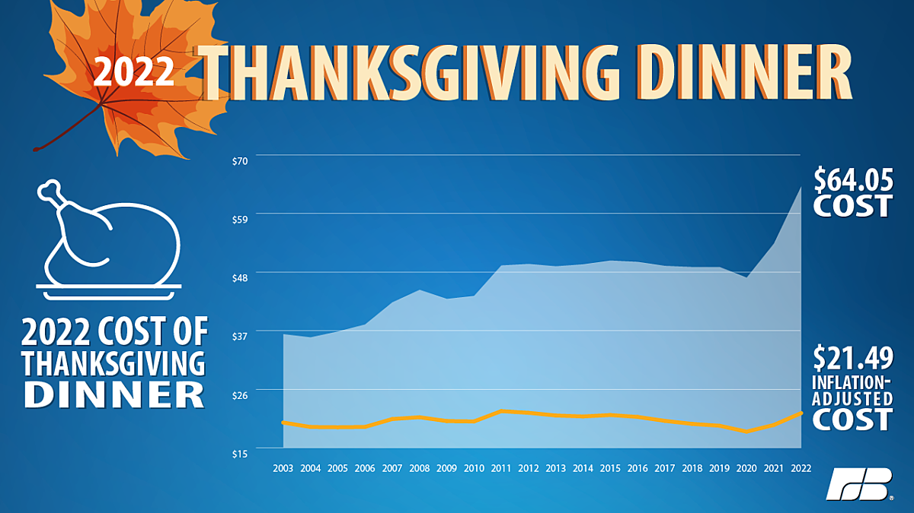

## Mid-term Exam - Short Answer Questions
### SMPA 2152 (Fall 23)

1. In 2014, researchers at Facebook published the results of a study in which 689,003 randomly selected users were shown either more positive posts, or more negative posts, than usual. The researchers measured how the users own posts changed in response to reading more positive or negative posts. The researchers wrote, "We felt that it was important to investigate the common worry that seeing friends post positive content leads to people feeling negative or left out." The subjects were not informed of that they were selected for the study, but Facebook's terms of service permit these kinds of studies, and Facebook frequently experiments with changes to its algorithms to understand the effect on user engagement. What are some of the ethical considerations at play in this study? In what ways did Facebook act ethically or unethically?

    > Possible answers include:
    
    > * Informed consent: the users were not given the opportunity to decide whether to participate in the study, which violates the principle of autonomous persons. The terms of service are not clear and unambiguous information about whta participation in the study involves and the potential harms or benefits of participation.
    > * Beneficence: The study could potentially harm participants by causing emotional distress. This may not be the least harmful way to obtain information about user responses to positive and negative posts.
    > * Understanding how users respond to different types of posts could lead to significant improvements in society, which justifies potentially harmful research as long as the harm is minimized.

2. One of the most cited studies in political science is about the causes of civil war. In this study, the authors argue that civil wars are not associated with ethnic or religious divisions but rather how vulnerable the country is to rebellion. The authors measure ethnic diversity as the number of distinct languages spoken by at least 1% of the country's population, and measure how vulnerable the country is to rebellion as the percent of the country that is mountainous (since rebels are better able to hide and surprise their opponents in rough terrain). Evaluate the operationalization of either ethnic diversity or vulnerability to rebellion. In what ways is this operationalization strong? In what ways is this operationalization weak?

    > Ethnic diversity measured as the number of languages spoken:
    
    > * Unambiguous: What does it mean for a language to be spoken? At home? At work? In school? As a second langauge? In addition, is language a good proxy for ethnicity?
    > * Concise: The definition is fairly concise.
    > * Familiar: It is not clear to most people what it means for 1% of a population to speak a particular language, but most people know that there are minority langauges spoken in many places.
    > * Available: Perhaps. This would require some kind of survey or government study, which may not exist, or may be biased or incomplete.
    
    > Vulnerability to rebellion as percent mountainous:
    
    > * Unambiguous: What is the distinction between hilly and mountainous? How mountainous must terrain be for it to be useful for rebels?
    > * Concise: The definition is concise.
    > * Familiar: Most people are familiar with mountainous terrain, but are unlikely to understand it's relationship to guerrilla warfare or other strategies of rebellion.
    > * Available: Likely available.

3. The political science book "The Big Sort" argues that people are moving to communities and parts of the country where others share their political beliefs, and this is contributing to political polarization. There is no doubt that the country's politics are divided by geography, but why might we be skeptical of the claim that people are moving to places where others share their political beliefs? Provide at least two reasons.

    > * Political beliefs are influenced by many of the same things that influence where someone lives. Confounders include the person's age (younger people are more likely to be liberal and live in cities), occupation or education (skilled/educated workers are more likely to be liberal and live in cities), religion (e.g., evangelical Christians are more likely to be conservative and live in places with evangelical congregations), and more.
    > * Political beliefs are also influenced by where someone lives (reverse causation). For example, voters who live in racially diverse areas may be more (or less) favorable towards race-based policies like affirmative action, or voters who live in areas with a lot of immigration may be more (or less) favorable towards restrictive immigration policies.

4. Evaluate the following graph from the American Farm Bureau. What elements of the graph would you change, and how would you change them?

    {width=65%}
    
    > * The y-axis is truncated (starts at \$15 rather than \$0), which distorts differences and makes the cost look like it has risen more significantly than it really has.
    > * The inflation-adjusted cost is caused to be hidden by it's lower position on the graph, being subsumed by the light blue area, and having a longer (and smaller) label on the right-hand side.
    > * No axis labels, source, or legend.
    > * Why is the overall cost represented in a different way (shaded blue area) than the inflation-adjusted cost (yellow line)?
