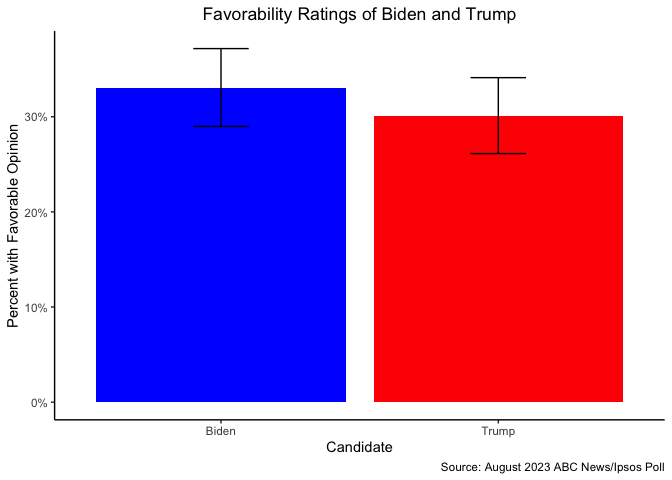
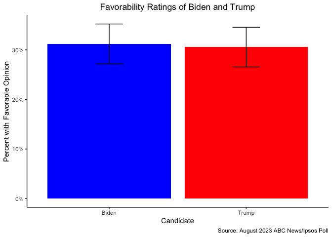
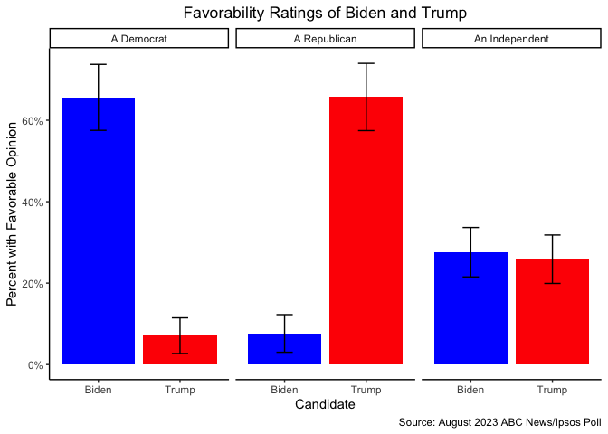

# Assignment \#4
Prof. Bell

For this homework, we will use the `tidyverse` to estimate the
favorability ratings of Joe Biden and Donald Trump among the U.S. public
using data from Roper iPoll.

You must submit your homework as a rendered Quarto document (HTML
preferred, PDF and Word acceptable). Please ensure that all code used to
generate the document (including your `setup` chunk) are visible in the
report. However, extraneous code that is not required for answering the
questions but that appears in your Quarto document will result in a
deduction (for example, `glimpse()` should not appear anywhere in your
rendered report).

Please turn in your `.qmd` file, the `_files` directory, and your
rendered Quarto document as a `.zip` folder on Blackboard. When you
export multiple items from Posit Cloud at once, it will automatically be
exported as a `.zip`.

``` r
library(tidyverse)
```

1.  Download the data on the [August 2023 ABC News/Ipsos
    poll](https://doi.org/10.25940/ROPER-31120497) from Roper iPoll and
    load the data in R.

``` r
poll <- read_csv("../../data/political_polling/31120497.csv")
```

2.  Look at the study documentation on Roper iPoll to determine what
    variables are used by Ipsos to weight the respondents. Show these
    variables for the ten respondents with the largest weights and the
    ten respondents with the smallest weights. What kinds of respondents
    do you think Ipsos has a harder time reaching? An easier time
    reaching?

    *It is not necessary to evaluate every weighting variable; usually,
    only one or two variables determine most of the weights, even if
    many weighting variables are used.*

#### Largest weights

``` r
poll |>
  select(Weight_PID, ppgender, ppethm, ppeduc5, ppreg4, ppmsacat, ppinc7, QPID) |>
  arrange(-Weight_PID) |>
  slice_head(n = 10)
```

    # A tibble: 10 × 8
       Weight_PID ppgender ppethm               ppeduc5 ppreg4 ppmsacat ppinc7 QPID 
            <dbl> <chr>    <chr>                <chr>   <chr>  <chr>    <chr>  <chr>
     1       3.28 Female   Black, Non-Hispanic  "High … MidWe… Metro    $50,0… An I…
     2       2.99 Female   2+ Races, Non-Hispa… "Some … South  Metro    $100,… An I…
     3       2.93 Female   2+ Races, Non-Hispa… "Bache… South  Non-Met… $25,0… A De…
     4       2.82 Female   White, Non-Hispanic  "Some … MidWe… Metro    $25,0… A Re…
     5       2.80 Female   Black, Non-Hispanic  "No hi… South  Metro    $50,0… A De…
     6       2.79 Female   Other, Non-Hispanic  "No hi… North… Metro    $50,0… A De…
     7       2.48 Female   Hispanic             "No hi… South  Metro    Less … Some…
     8       2.48 Female   White, Non-Hispanic  "High … South  Metro    $25,0… A De…
     9       2.47 Female   Hispanic             "Maste… South  Metro    Less … A Re…
    10       2.44 Female   White, Non-Hispanic  "Some … MidWe… Metro    $100,… A Re…

#### Smallest weights

``` r
poll |>
  select(Weight_PID, ppgender, ppethm, ppeduc5, ppreg4, ppmsacat, ppinc7, QPID) |>
  arrange(Weight_PID) |>
  slice_head(n = 10)
```

    # A tibble: 10 × 8
       Weight_PID ppgender ppethm              ppeduc5  ppreg4 ppmsacat ppinc7 QPID 
            <dbl> <chr>    <chr>               <chr>    <chr>  <chr>    <chr>  <chr>
     1      0.353 Male     White, Non-Hispanic "Master… West   Metro    $75,0… A De…
     2      0.362 Male     White, Non-Hispanic "Some c… West   Metro    $75,0… Some…
     3      0.393 Male     White, Non-Hispanic "High s… West   Non-Met… $75,0… Some…
     4      0.396 Male     White, Non-Hispanic "Some c… North… Metro    $50,0… Some…
     5      0.402 Male     White, Non-Hispanic "Bachel… North… Non-Met… $75,0… An I…
     6      0.404 Male     White, Non-Hispanic "Some c… West   Metro    $75,0… An I…
     7      0.412 Male     White, Non-Hispanic "High s… North… Metro    $10,0… Some…
     8      0.421 Male     White, Non-Hispanic "Master… West   Metro    $150,… A De…
     9      0.433 Female   White, Non-Hispanic "Master… West   Metro    $75,0… A De…
    10      0.433 Female   White, Non-Hispanic "Bachel… West   Metro    $75,0… A De…

3.  Create a single graph comparing the **unweighted** proportion of
    respondents who have a **favorable** opinion of Joe Biden (`Q1_2`)
    and a favorable opinion of Donald Trump (`Q1_1`). Be sure to show
    the margin of error on your graph.

    *Hint: you will need to use `pivot_longer()` in your answer. Review
    this function from our class on tidying data. In addition, it will
    help to rename `Q1_1` and `Q1_2` before using `pivot_longer()`.*

``` r
poll |>
  rename(Trump = Q1_1,
         Biden = Q1_2) |>
  pivot_longer(cols = c(Trump, Biden), names_to = "Candidate", values_to = "Response") |>
  count(Candidate, Response) |>
  group_by(Candidate) |>
  mutate(prop = n/sum(n),
         resp = sum(n),
         moe = 1.96 * sqrt((prop * (1 - prop))/resp)) |>
  filter(Response == "Favorable") |>
  ggplot() +
    geom_bar(aes(x = Candidate, y = prop, fill = Candidate), stat = "identity", position = "dodge") +
    geom_errorbar(aes(x = Candidate, ymin = prop-moe, ymax = prop+moe, group = Candidate), position = position_dodge(.9), width = .2) +
  scale_y_continuous(labels = scales::percent_format()) +
  scale_fill_manual(values = c("blue", "red")) +
  labs(x = "Candidate",
       y = "Percent with Favorable Opinion",
       title = "Favorability Ratings of Biden and Trump",
       caption = "Source: August 2023 ABC News/Ipsos Poll") +
  theme_classic() +
  theme(plot.title = element_text(hjust = .5),
        legend.position = "none")
```



4.  Create the same graph as in \#3, but this time using the
    **weighted** proportion of respondents who have a favorable opinion
    of Joe Biden and Donald Trump (`Q1_1`). Be sure to show the margin
    of error on your graph. What differences do you notice between the
    weighted and unweighted results? What does this tell us about which
    candidate’s supporters are harder for Ipsos to reach?

``` r
poll |>
  rename(Trump = Q1_1,
         Biden = Q1_2) |>
  pivot_longer(cols = c(Trump, Biden), names_to = "Candidate", values_to = "Response") |>
  count(Candidate, Response, wt = Weight_PID) |>
  group_by(Candidate) |>
  mutate(prop = n/sum(n),
         resp = sum(n),
         moe = 1.96 * sqrt((prop * (1 - prop))/resp)) |>
  filter(Response == "Favorable") |>
  ggplot() +
    geom_bar(aes(x = Candidate, y = prop, fill = Candidate), stat = "identity", position = "dodge") +
    geom_errorbar(aes(x = Candidate, ymin = prop-moe, ymax = prop+moe, group = Candidate), position = position_dodge(.9), width = .2) +
  scale_y_continuous(labels = scales::percent_format()) +
  scale_fill_manual(values = c("blue", "red")) +
  labs(x = "Candidate",
       y = "Percent with Favorable Opinion",
       title = "Favorability Ratings of Biden and Trump",
       caption = "Source: August 2023 ABC News/Ipsos Poll") +
  theme_classic() +
  theme(plot.title = element_text(hjust = .5),
        legend.position = "none")
```



**BONUS (3 points)**: Create the same graph as in \#4, but use facets to
compare favorability ratings of Biden and Trump among Democratic,
Republican, and Independent voters (party ID is `QPID`).

*This question goes beyond our work in class. Think about what it means
to add an additional group to our analysis. How will this affect our
`count()` and `group_by()` functions?*

``` r
poll |>
  rename(Trump = Q1_1,
         Biden = Q1_2) |>
  pivot_longer(cols = c(Trump, Biden), names_to = "Candidate", values_to = "Response") |>
  count(QPID, Candidate, Response, wt = Weight_PID) |>
  group_by(QPID, Candidate) |>
  mutate(prop = n/sum(n),
         resp = sum(n),
         moe = 1.96 * sqrt((prop * (1 - prop))/resp)) |>
  filter(QPID %in% c("A Democrat", "An Independent", "A Republican") & Response == "Favorable") |>
  ggplot() +
    geom_bar(aes(x = Candidate, y = prop, fill = Candidate), stat = "identity", position = "dodge") +
    geom_errorbar(aes(x = Candidate, ymin = prop-moe, ymax = prop+moe, group = Candidate), position = position_dodge(.9), width = .2) +
  scale_y_continuous(labels = scales::percent_format()) +
  scale_fill_manual(values = c("blue", "red")) +
  labs(x = "Candidate",
       y = "Percent with Favorable Opinion",
       title = "Favorability Ratings of Biden and Trump",
       caption = "Source: August 2023 ABC News/Ipsos Poll") +
  theme_classic() +
  theme(plot.title = element_text(hjust = .5),
        legend.position = "none") +
  facet_wrap(~ QPID)
```


