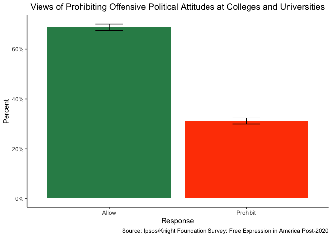
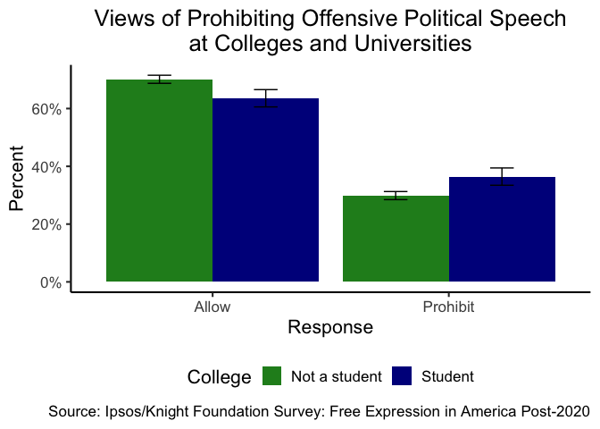

# Assignment \#5
Prof. Bell

For this homework, we will use hypothesis tests and regression to
explore Americans’ views of free expression on college campuses. You
will need to download the data for the [Ipsos/Knight Foundation Survey:
Free Expression in America
Post-2020](https://doi.org/10.25940/ROPER-31119146) from Roper iPoll.

You must submit your homework as a rendered Quarto document (HTML
preferred, PDF and Word acceptable). Please ensure that all code used to
generate the document (including your `setup` chunk) are visible in the
report. However, extraneous code that is not required for answering the
questions but that appears in your Quarto document will result in a
deduction (for example, `glimpse()` should not appear anywhere in your
rendered report).

Please turn in your `.qmd` file, the `_files` directory, and your
rendered Quarto document as a `.zip` folder on Blackboard. When you
export multiple items from Posit Cloud at once, it will automatically be
exported as a `.zip`.

``` r
library(tidyverse)
library(sjstats)
library(sjPlot)
poll <- read_csv("../../data/regression/31119146.csv")
```

**BEFORE YOU BEGIN**: Make the following change to your data frame in
your setup chunk before proceeding to any analysis.

``` r
poll <- 
  poll |>
  mutate(Main_Weights = ifelse(!is.na(Students_Weights), Students_Weights, Main_Weights))
```

1.  Generate a graph that shows the weighted topline results for the
    question, “Should public universities and colleges allow or prohibit
    a person sharing political views that are offensive to some on
    campus?” The relevant variable is `Q11_4` and the relevant weighting
    variable is `Main_Weights`.

``` r
poll |>
  filter(Q11_4 != "Skipped") |>
  count(Q11_4, wt = Main_Weights) |>
  mutate(prop = n/sum(n),
         resp = sum(n),
         moe = 1.96 * sqrt((prop * (1 - prop))/resp)) |>
  ggplot() +
  geom_bar(aes(x = Q11_4, y = prop, fill = Q11_4), stat = "identity", position = "dodge") +
    geom_errorbar(aes(x = Q11_4, ymin = prop-moe, ymax = prop+moe, group = Q11_4), position = position_dodge(.9), width = .2) +
  scale_y_continuous(labels = scales::percent_format()) +
  scale_fill_manual(values = c("seagreen", "orangered")) +
  labs(x = "Response",
       y = "Percent",
       title = "Views of Prohibiting Offensive Political Attitudes at Colleges and Universities",
       caption = "Source: Ipsos/Knight Foundation Survey: Free Expression in America Post-2020") +
  theme_classic() +
  theme(plot.title = element_text(hjust = .5),
        legend.position = "none")
```



**BONUS:** Compare the weighted topline results for college students and
non-college students in the same graph. The relevant variable is
`Student1`. (Hint: Non-college students are represented with the values
`No` and `NA`.)

``` r
poll |>
  filter(Q11_4 != "Skipped") |>
  mutate(College = ifelse(Student1 == "No" | is.na(Student1), "Not a student", "Student")) |>
  count(College, Q11_4, wt = Main_Weights) |>
  group_by(College) |>
  mutate(prop = n/sum(n),
         resp = sum(n),
         moe = 1.96 * sqrt((prop * (1 - prop))/resp)) |>
  ggplot() +
  geom_bar(aes(x = Q11_4, y = prop, fill = College), stat = "identity", position = "dodge") +
    geom_errorbar(aes(x = Q11_4, ymin = prop-moe, ymax = prop+moe, group = College), position = position_dodge(.9), width = .2) +
  scale_y_continuous(labels = scales::percent_format()) +
  scale_fill_manual(values = c("forestgreen", "darkblue")) +
  labs(x = "Response",
       y = "Percent",
       title = "Views of Prohibiting Offensive Political Speech\nat Colleges and Universities",
       caption = "Source: Ipsos/Knight Foundation Survey: Free Expression in America Post-2020") +
  theme_classic(base_size = 16) +
  theme(plot.title = element_text(hjust = .5),
        legend.position = "bottom")
```



2.  Conduct a weighted hypothesis test showing whether the proportions
    of non-college students and college students who believe that
    colleges and universities should **allow** offensive political
    speech on campus are different. You must write both the $H_0$ and
    the $H_A$. How do you interpret the results of your hypothesis test?
    The relevant variable for college students is `Student1`. (Hint:
    Non-college students are represented with the values `No` and `NA`.)

``` r
poll2 <-
  poll |>
  filter(Q11_4 != "Skipped") |>
  mutate(College = ifelse(Student1 == "No" | is.na(Student1), "Not a student", "Student"),
         College = factor(College, levels = c("Not a student", "Student")),
         AllowSpeech = ifelse(Q11_4 == "Allow", 1, 0))

weighted_ttest(AllowSpeech ~ College + Main_Weights,
               poll2)
```


    Two-Sample t-test (two.sided)

    # comparison of AllowSpeech by College
    # t=3.91  df=1452  p-value=0.000

      mean in group Not a student: 0.701
      mean in group Student      : 0.636
      difference of mean         : 0.066 [0.033  0.099]

3.  Conduct a linear probability model regression of whether colleges
    and universities should **allow** offensive political speech on
    campus on student status and at least two confounders. Please
    explain why you chose to control for those two confounders (i.e.,
    why do you think that variable is a confounder?)

    How do you interpret the effect of being a current college student
    on support for allowing offensive political speech on campus?

    Some potential confounders include:

    - Party ID: `QPID100`
    - Gender: `ppgender`
    - Household income: `ppinc7`
    - Race/Ethnicity: `ppethm`

``` r
poll3 <-
  poll2 |>
  filter(QPID100 != "Skipped")

reg1 <- lm(AllowSpeech ~ College + QPID100 + ppinc7, data = poll3)

tab_model(reg1)
```

<table data-quarto-postprocess="true"
style="border-collapse:collapse; border:none;">
<colgroup>
<col style="width: 25%" />
<col style="width: 25%" />
<col style="width: 25%" />
<col style="width: 25%" />
</colgroup>
<tbody>
<tr class="odd">
<td data-quarto-table-cell-role="th"
style="text-align: center; border-top: double; font-style: normal; font-weight: bold; padding: 0.2cm;"> </td>
<td colspan="3" data-quarto-table-cell-role="th"
style="text-align: center; border-top: double; font-style: normal; font-weight: bold; padding: 0.2cm;">Allow
Speech</td>
</tr>
<tr class="even">
<td
style="text-align: center; border-bottom: 1px solid; font-style: italic; font-weight: normal;">Predictors</td>
<td
style="text-align: center; border-bottom: 1px solid; font-style: italic; font-weight: normal;">Estimates</td>
<td
style="text-align: center; border-bottom: 1px solid; font-style: italic; font-weight: normal;">CI</td>
<td
style="text-align: center; border-bottom: 1px solid; font-style: italic; font-weight: normal;">p</td>
</tr>
<tr class="odd">
<td
style="text-align: left; padding: 0.2cm; vertical-align: top;">(Intercept)</td>
<td
style="text-align: left; padding: 0.2cm; vertical-align: top;">0.45</td>
<td
style="text-align: left; padding: 0.2cm; vertical-align: top;">0.40 – 0.50</td>
<td
style="text-align: left; padding: 0.2cm; vertical-align: top;"><strong>&lt;0.001</strong></td>
</tr>
<tr class="even">
<td
style="text-align: left; padding: 0.2cm; vertical-align: top;">College
[Student]</td>
<td
style="text-align: left; padding: 0.2cm; vertical-align: top;">-0.04</td>
<td
style="text-align: left; padding: 0.2cm; vertical-align: top;">-0.07 – -0.01</td>
<td
style="text-align: left; padding: 0.2cm; vertical-align: top;"><strong>0.007</strong></td>
</tr>
<tr class="odd">
<td
style="text-align: left; padding: 0.2cm; vertical-align: top;">QPID100
[Independent]</td>
<td
style="text-align: left; padding: 0.2cm; vertical-align: top;">0.16</td>
<td
style="text-align: left; padding: 0.2cm; vertical-align: top;">0.13 – 0.19</td>
<td
style="text-align: left; padding: 0.2cm; vertical-align: top;"><strong>&lt;0.001</strong></td>
</tr>
<tr class="even">
<td
style="text-align: left; padding: 0.2cm; vertical-align: top;">QPID100
[Republican]</td>
<td
style="text-align: left; padding: 0.2cm; vertical-align: top;">0.20</td>
<td
style="text-align: left; padding: 0.2cm; vertical-align: top;">0.16 – 0.23</td>
<td
style="text-align: left; padding: 0.2cm; vertical-align: top;"><strong>&lt;0.001</strong></td>
</tr>
<tr class="odd">
<td
style="text-align: left; padding: 0.2cm; vertical-align: top;">QPID100
[Something else]</td>
<td
style="text-align: left; padding: 0.2cm; vertical-align: top;">0.07</td>
<td
style="text-align: left; padding: 0.2cm; vertical-align: top;">0.03 – 0.12</td>
<td
style="text-align: left; padding: 0.2cm; vertical-align: top;"><strong>0.001</strong></td>
</tr>
<tr class="even">
<td
style="text-align: left; padding: 0.2cm; vertical-align: top;">ppinc7
[$100,000 to<br />
$149,999]</td>
<td
style="text-align: left; padding: 0.2cm; vertical-align: top;">0.19</td>
<td
style="text-align: left; padding: 0.2cm; vertical-align: top;">0.13 – 0.24</td>
<td
style="text-align: left; padding: 0.2cm; vertical-align: top;"><strong>&lt;0.001</strong></td>
</tr>
<tr class="odd">
<td
style="text-align: left; padding: 0.2cm; vertical-align: top;">ppinc7
[$150,000 or more]</td>
<td
style="text-align: left; padding: 0.2cm; vertical-align: top;">0.24</td>
<td
style="text-align: left; padding: 0.2cm; vertical-align: top;">0.19 – 0.29</td>
<td
style="text-align: left; padding: 0.2cm; vertical-align: top;"><strong>&lt;0.001</strong></td>
</tr>
<tr class="even">
<td
style="text-align: left; padding: 0.2cm; vertical-align: top;">ppinc7
[$25,000 to<br />
$49,999]</td>
<td
style="text-align: left; padding: 0.2cm; vertical-align: top;">0.03</td>
<td
style="text-align: left; padding: 0.2cm; vertical-align: top;">-0.02 – 0.08</td>
<td
style="text-align: left; padding: 0.2cm; vertical-align: top;">0.254</td>
</tr>
<tr class="odd">
<td
style="text-align: left; padding: 0.2cm; vertical-align: top;">ppinc7
[$50,000 to<br />
$74,999]</td>
<td
style="text-align: left; padding: 0.2cm; vertical-align: top;">0.11</td>
<td
style="text-align: left; padding: 0.2cm; vertical-align: top;">0.06 – 0.17</td>
<td
style="text-align: left; padding: 0.2cm; vertical-align: top;"><strong>&lt;0.001</strong></td>
</tr>
<tr class="even">
<td
style="text-align: left; padding: 0.2cm; vertical-align: top;">ppinc7
[$75,000 to<br />
$99,999]</td>
<td
style="text-align: left; padding: 0.2cm; vertical-align: top;">0.16</td>
<td
style="text-align: left; padding: 0.2cm; vertical-align: top;">0.10 – 0.21</td>
<td
style="text-align: left; padding: 0.2cm; vertical-align: top;"><strong>&lt;0.001</strong></td>
</tr>
<tr class="odd">
<td
style="text-align: left; padding: 0.2cm; vertical-align: top;">ppinc7
[Under $10,000]</td>
<td
style="text-align: left; padding: 0.2cm; vertical-align: top;">-0.03</td>
<td
style="text-align: left; padding: 0.2cm; vertical-align: top;">-0.11 – 0.05</td>
<td
style="text-align: left; padding: 0.2cm; vertical-align: top;">0.451</td>
</tr>
<tr class="even">
<td
style="text-align: left; padding: 0.2cm; vertical-align: top; padding-top: 0.1cm; padding-bottom: 0.1cm; border-top: 1px solid;">Observations</td>
<td colspan="3"
style="text-align: left; padding: 0.2cm; vertical-align: top; padding-top: 0.1cm; padding-bottom: 0.1cm; border-top: 1px solid;">5168</td>
</tr>
<tr class="odd">
<td
style="text-align: left; padding: 0.2cm; vertical-align: top; padding-top: 0.1cm; padding-bottom: 0.1cm;">R<sup>2</sup>
/ R<sup>2</sup> adjusted</td>
<td colspan="3"
style="text-align: left; padding: 0.2cm; vertical-align: top; padding-top: 0.1cm; padding-bottom: 0.1cm;">0.069
/ 0.067</td>
</tr>
</tbody>
</table>
