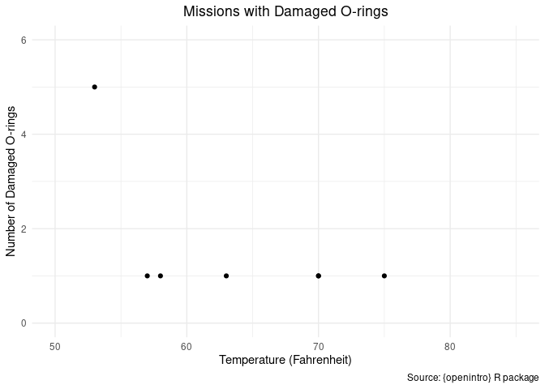
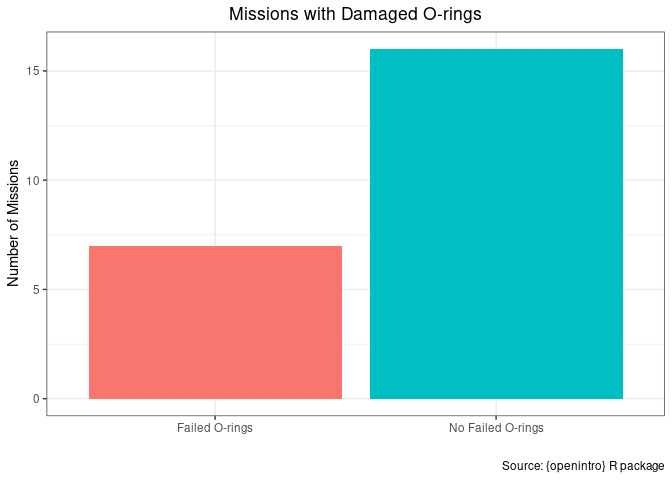
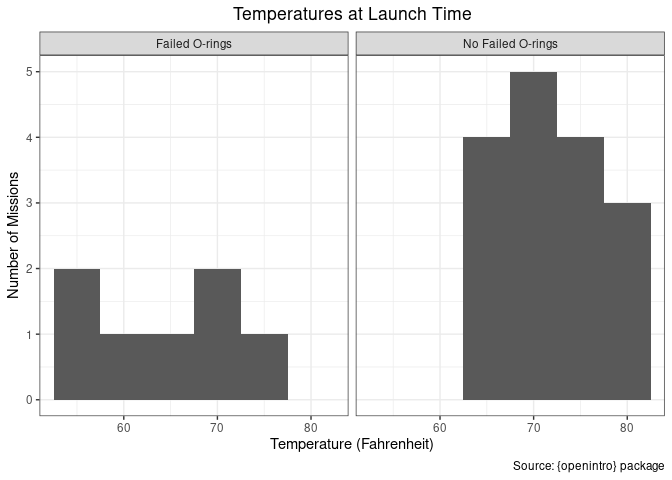
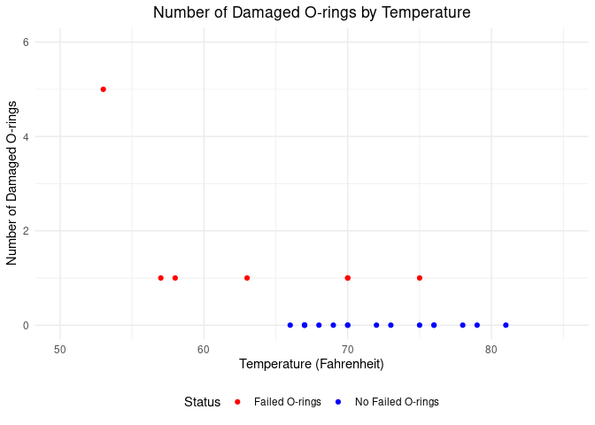

# The Challenger Space Shuttle Disaster
Prof. Bell
2023-09-27

## Introduction to Quarto

[Quarto](https://quarto.org) is a tool to easily generate reports using
code. RStudio comes with a Quarto integration pre-installed.[^1] To open
a new Quarto file, go to the “New File” button and select “Quarto
Document.”

Quarto is able to generate reports as HTML, PDF, Word, and other file
types. Because we are working in Posit Cloud, we will only render our
reports as HTML and PDF documents, which we can preview in the “Viewer”
pane.

There are three basic principles of Quarto that you should know before
we get started:

- Quarto is a separate tool from R and RStudio. In fact, Quarto can be
  used with many different coding languages. For that reason, we will
  now be working with `.qmd` scripts rather than `.R` scripts.

  Quarto itself uses it’s own language, as well as another language
  called Markdown. If you get stuck, go to the “Help” drop-down menu to
  go to the Quarto cheatsheet or the Markdown Quick Reference.

- When you render a Quarto document, it is as if you are running your
  code in a **brand new** R session. This means that none of the objects
  in your Environment pane will be known to your `.qmd` file. Any
  objects that you want to use in your Quarto document need to be
  created within the `.qmd` script.

  In addition, Quarto will be able to access all your installed
  packages, but you will need to load those packages with `library()`
  since the document is rendering in a new R session.

  - The [working
    directory](https://r4ds.hadley.nz/workflow-scripts.html#where-does-your-analysis-live)
    is the folder where the `.qmd` file lives.

  - A `.qmd` file with an error in the code will not render.

- The R code you write in a `.qmd` script is just like the code that you
  write in an `.R` script, except that it will go inside of a “code
  chunk.” You can create a new code chunk by clicking on the green “C”
  icon in the upper right of the Scripts pane. Code chunks will run in
  the order that the are written in the script (top to bottom), *except*
  for a special chunk called the `setup` chunk. The `setup` chunk is
  always run first. It should contain all of the introductory commands
  that we usually include at the beginning of our `.R` scripts. Here is
  the `setup` chunk for this document:

``` r
library(tidyverse)
library(openintro)
```

## The Challenger Space Shuttle Disaster

In 1986, the NASA space shuttle Challenger exploded just over a minute
after launch due to a faulty part called an O-ring. Unfortunately, NASA
engineers had enough information to know the the O-rings were likely to
fail, but did not display the information in a way that would lead
mission control make the decision to cancel the launch. Let’s load the
`orings` data from the `openintro` package to see what went wrong.

We can now `glimpse()` our data and use the help file (`?orings`) to
learn more about our data.

``` r
glimpse(orings)
?orings
```

### The Morning of the Launch

NASA engineers convened an emergency conference on the morning of the
launch to consider whether the O-rings might fail due to some
particularly cold temperatures at the Kennedy Space Center that day.
Someone scribbled down a chart to show all the O-ring failures that NASA
had experienced in the past:

<details>
<summary>Code</summary>

``` r
past_failures <- orings[orings$damaged > 0,]

ggplot(past_failures) +
    geom_point(aes(x = temperature, y = damaged)) +
  scale_x_continuous(limits = c(50,85)) +
  scale_y_continuous(limits = c(0, 6)) +
  labs(x = "Temperature (Fahrenheit)",
       y = "Number of Damaged O-rings",
       title = "Missions with Damaged O-rings",
       caption = "Source: {openintro} R package") +
  theme_minimal() +
  theme(plot.title = element_text(hjust = .5))
```

</details>



From this data, there does not appear to be a clear correlation between
temperature and O-ring failures. But here is the problem: we only know
half of the story. With only these data points, we aren’t seeing most of
the data. How many missions did not have any failed O-rings?

<details>
<summary>Code</summary>

``` r
orings$fail <- ifelse(orings$damaged > 0, "Failed O-rings", "No Failed O-rings")

ggplot(orings) +
  geom_bar(aes(x = fail, fill = fail)) +
  labs(x = "",
       y = "Number of Missions",
       title = "Missions with Damaged O-rings",
       caption = "Source: {openintro} R package") +
  theme_bw() +
  theme(plot.title = element_text(hjust = .5),
        legend.position = "none")
```

</details>



In fact, 7 missions had no failed O-rings. How do the distributions of
temperatures compare in these two groups?

<details>
<summary>Code</summary>

``` r
ggplot(orings) +
  geom_histogram(aes(x = temperature), binwidth = 5) +
  facet_wrap(~ fail) +
  labs(x = "Temperature (Fahrenheit)",
       y = "Number of Missions",
       title = "Temperatures at Launch Time",
       caption = "Source: {openintro} package") +
  theme_bw() +
  theme(plot.title = element_text(hjust = .5))
```

</details>



Now it seems much more likely that temperature is correlated with O-ring
failure. Let’s imagine that the NASA engineers had designed their
scatterplot to show this difference:

<details>
<summary>Code</summary>

``` r
ggplot(orings) +
    geom_point(aes(x = temperature, y = damaged, color = fail)) +
  scale_x_continuous(limits = c(50,85)) +
  scale_y_continuous(limits = c(0, 6)) +
  scale_color_manual(values = c("red", "blue")) +
  labs(x = "Temperature (Fahrenheit)",
       y = "Number of Damaged O-rings",
       title = "Number of Damaged O-rings by Temperature",
       color = "Status") +
  theme_minimal() +
  theme(plot.title = element_text(hjust = .5),
        legend.position = "bottom")
```

</details>



If NASA engineers had presented the data in this way, it seems much more
likely that mission control would have cancelled the launch.

[^1]: If you are using RStudio Desktop, there may be other installations
    that are required on your computer.
